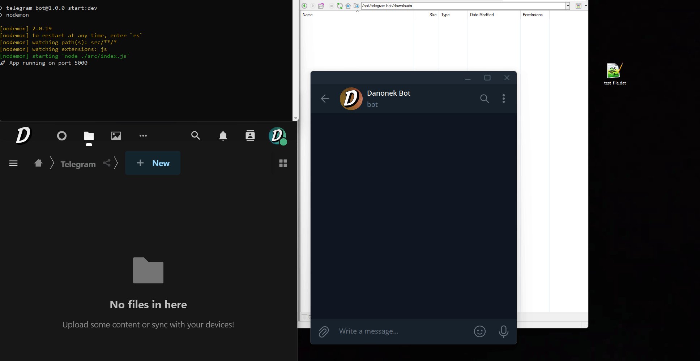

# TTNC (Telegram To Nextcloud)

This Telegram bot is designed to facilitate the process of uploading files from Telegram chats to a Nextcloud instance. It uses Telegraf, Express, Axios, and the Nextcloud Node.js client libraries to accomplish this task.

## Features

- **File Uploading**: Send a file, photo or video file to the bot via Telegram.
- **Nextcloud Integration**: Automatically uploads the file to a specified Nextcloud instance.
- **Data Security**: Deletes the uploaded data locally and from the Telegram chat using the Telegram API after successful upload to Nextcloud.

## Demo




## Prerequisites

Before running the bot, ensure you have the following:

- Node.js installed on your system
- Telegram bot token obtained from BotFather on Telegram
- Nextcloud instance details (URL, username, password)
- Node.js libraries: Telegraf, Express, Axios, and Nextcloud Node.js client

## Installation

1. Clone the repository:

    ```bash
    git clone https://github.com/DanonekTM/TTNC.git
    ```

2. Install dependencies:

    ```bash
    cd TTNC
    npm install
    ```

3. Set up configuration:

    Rename the `.env.example` to `.env` file and change the values

    ```
    PORT=5000
    TOKEN=YOURTELEGRAMTOKENHERE
    SERVER_URL=https://example.com/
    NEXTCLOUD_USERNAME="USERNAME"
    NEXTCLOUD_PASSWORD="PASSWORD"
    NEXTCLOUD_URL="https://cloud.example.com"
    DOWNLOADS_PATH="/PATH/TO/DOWNLOADS/FOLDER"
    ```

4. Run the bot:

    ```bash
    npm run start
    ```

## Usage

1. Start a conversation with the bot on Telegram.
2. Send a file you want to upload to the Nextcloud instance.
3. The bot will download the file locally, upload it to Nextcloud, and then delete the data locally and from the Telegram chat.